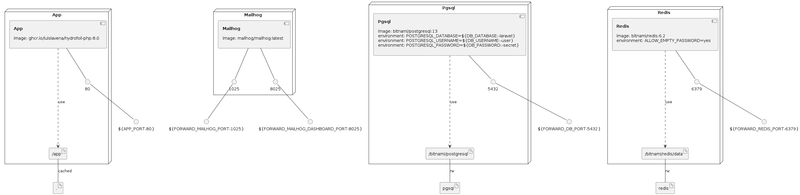

# Project Name
> (describe purpose of this project)

Summary of the project. This is the first thing you read when you view this
project. This is a great place to summarize the goals or intentions of this
project. Generally speaking, this section is optional, but is a nice way to
get a snapshot of what this project is about.

Also include information on the maturity of the project, like when it was
launched, what its current production environment is like, and who it is
maintained by.

## Features

What are all the bells and whistles that are significant or unique to this
project?

* What's the main functionality
* What new thing does this project provide?
* What unique feature does this project include?

## Overview

Describe the architecture in which this project fits, and point to any other
repositories that are make up the full stack of software. Describe how each
piece fits together.

## Requirements

List any and all requirements, include hardware, server software, and
third-party libraries.

List also if retrieve of specific configuration is required prior launching
the project (Eg. obtain a copy of database, obtain specific settings from
the vault).

## Development

A quick introduction of the minimal setup you need to get the application up
and running.

### Frontend architecture
Frontend follows a component approach build with Laravel Blade templating engine.

Frontend architecture is defined in two different places:

- `resources/frontend`, for assets, scripts and styles files,
- `resources/views/frontend`, pages and components
 
Global aliases for Blade components have been set: 
- layouts
- pages
- partials
- components

You can use them to import components, example: `<x-partials::head-assets/>`


Following libraries have been installed and pre-setup:
- [Tailwind css](https://tailwindcss.com/)
- [A17 Tailwind plugins](http://tailwind-plugins.dev.area17.com/)
- [A17 JS Helpers](https://github.com/area17/js-helpers/wiki)
- [A17 Behaviors](https://github.com/area17/a17-behaviors/wiki)

With A17 Tailwind plugins, you can define all your frontend configuration inside `frontend.config.json`. This file is shared with current Tailwind config and also shared as a global variable `FE` into each Blade file.

#### Installation

To install and build frontend dependencies, you can run the following commands. Depending on your configuration, you can run them locally or inside a docker container. 

Frontend is build with [Vite](https://vitejs.dev/) and [Laravel Vite plugin](https://github.com/laravel/vite-plugin) and requires Node(16+) and NPM(8+).

```console
# Install dependencies
$ npm install

# Bundle dependencies in dev mode with HMR enable
$ npm run dev

# Bundle dependencies for production
$ npm run build
```
### Deployment / Release

Describe here the strategy followed by this project in relation to deployment
and releases. You can also describe the branching approach.

Eg. environment-specific branches, CI/CD with push-to-deploy approach,
production restrictions and how releases are prepared, etc.

## Configurations

Here you should write what are all of the configurations a user can enter
when using the project, and which file each config is set if applicable.

## Linters and code formatters
We are using a series of tools to prettify and lint the code we write:

- Husky: to install and run the pre-commit hooks
- PHPStan: to do static analysis check on PHP code
- PHP-CS-Fixer: to remove unused dependencies and do some basic formatting
- Prettier: to fully format the code
- Eslint: to find and fix problems in JavaScript files
- Stylelint: to find and fix problems in CSS files
- Blast: if installed, we run it to test if it's compilable
- Git conflict markers: the pre-commit checker tool also checks if the developer didn't stage any Git conflicted files by looking for conflict markers on the staged files.
 
These tools are executed automatically on every commit, only on staged files (except for Blast), and for it to work you need to make sure you executed. Composer and NPM are responsible for making sure husky is installed. And these commands are also available if a developer needs to run the commands manually:

Global commands:

- sh tools/linters.sh lint
- sh tools/linters.sh format

Specific commands:

- sh tools/linters.sh phpstan
- sh tools/linters.sh eslint
- sh tools/linters.sh prettier
- sh tools/linters.sh blast
- sh tools/linters.sh php-cs-fixer

Commands execution also generates a log file with the result at tools/logs/<tool-name>.log, you can check for PHPStan errors on this file, for example.
Linter commands have available aliases and can be run through Composer or NPM. For more details take a look to composer.json file and package.json file.  

### Editors
We highly recommend you to configure your editor to take in account
current linters configurations files.


### Infrastructure model

